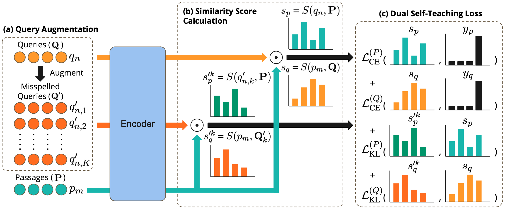

# Dual Self-Teaching (DST) for Dense Retrieval
This repository contains the code for the paper [Typo-Robust Representation Learning for Dense Retrieval](https://openreview.net/pdf?id=A5hKjXkDHd), ACL 2023.



# Installation
We provide a ```setup.sh``` script to install this repository and python dependency packages, run the following command:
```
sh setup.sh
```

(Optional) To evaluate the models using our evaluation script, you'll need to install the [trec_eval](https://github.com/usnistgov/trec_eval).

# Download Model Checkpoints
We provide our finetuned model checkpoints for [BERT-based DST-DPR](https://drive.google.com/file/d/1PjPF1EX7apX5KlQbRBzZ2BzulLDMg8zG/view?usp=sharing) and [CharacterBERT-based DST-DPR](https://drive.google.com/file/d/17IgUJg-SNf6homWx1_o9CNbgls8-eFgG/view?usp=sharing).

# Train Models
In case you want to train the models from scratch, we provide the training script as follows:

To train the BERT-based DST-DPR model, run the following command:
```
sh scripts/train_bert.sh
```

To train the CharacterBERT-based DST-DPR model, download the pre-trained [CharacterBERT](https://github.com/helboukkouri/character-bert/tree/0c1f5c2622950988833a9d95e29bc26864298592#pre-trained-models) with this [link](https://docs.google.com/uc?id=11-kSfIwSWrPno6A4VuNFWuQVYD8Bg_aZ), and run the following command:
```
sh scripts/train_characterbert.sh
```

# Evaluation
In this section, we describe the steps to evaluate the BERT-based DST-DPR model on the [MS MARCO](https://microsoft.github.io/msmarco/) and [DL-typo](https://github.com/ielab/CharacterBERT-DR/tree/main/data) passage ranking datasets.

First, we need to encode the passages and queries into dense vectors using the trained models, then retrieve the top-k passages for each query. To do so, run the following command:
```
sh scripts/retrieve_bert.sh
```

This should generate the ```msmarco_bert_embs``` folder containing dense vectors of passages and queries, and ```rank_bert``` folder containing the top-k passages for each query. 
To obtain the evaluation results, using the following command:
```
sh scripts/eval_bert.sh
```

Likewise, to evaluate the CharacterBERT-based DST-DPR model, use ```retrieve_characterbert.sh``` and ```eval_characterbert.sh```.
